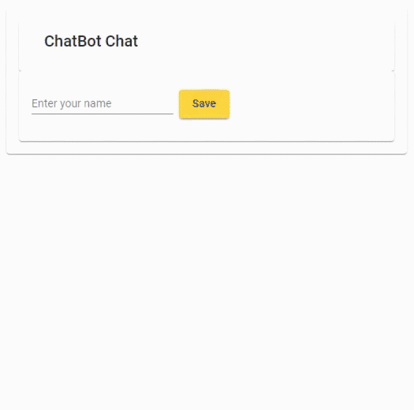

:data-uri:

= ChatBot -- Quiz -- Extended

You are going to create a fake chatbot app to please a big enterprise customer who wants to keep its clients occupied without having to hire support stuff.

The amount of code you have to write is very limited this time -- the major hurdle is to use an API you are not familiar with, haven't implemented yourself and don't have source code access to.

== Tasks

* This time you have to use an actual and very profound chat bot provided to you as a server application in a Docker container
* Most of the Angular application is already complete
* Implement the service used by the components
** Make sure to not 'calculate' the bot answers locally but use the service instead

== Service API

In general the API is very, very simple.
Still, you'll have to follow some rules to use it.

* Every request requires an individual API token which has been provided to you -- make sure to provide it (and always the same)
* Familiarize yourself with the API using the Swagger UI
** Look at the URLs and HTTP verbs to use
** Make sure to look at the DTO objects defined
*** And which of their properties are required
* Chat ID
** If you send a message without a chat id a new one is created for you
** Subsequently, you are supposed to send this id with all other messages to associate them with the chat (which the server stores and provides in case you need it)
* Simulating a real chat bot: the service implementation of the chat bot is as simple as the Angular one before, so it won't understand anything.
** An artificial delay of 1.5s has been added on the server side, so your requests will actually take some time.

== Starter Code

Most parts of the project are already provided to get you started and allow you to complete the task in a short time.
Complete the application.
